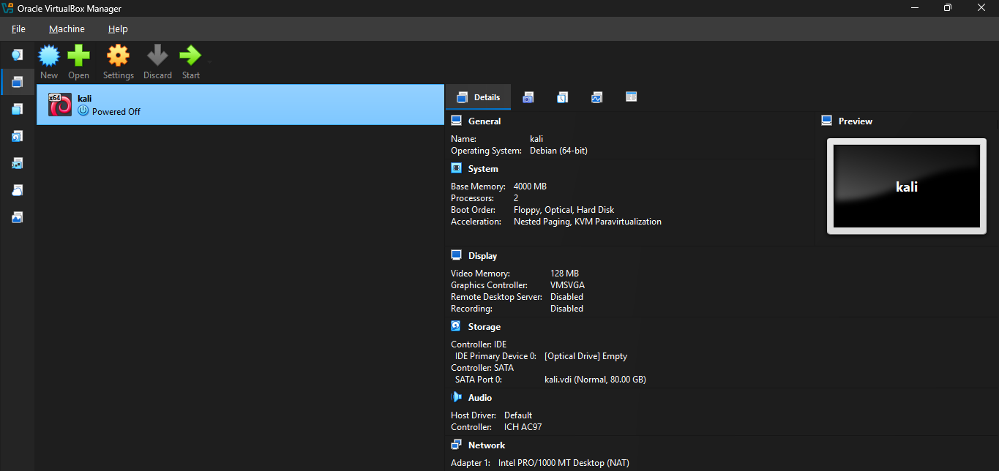
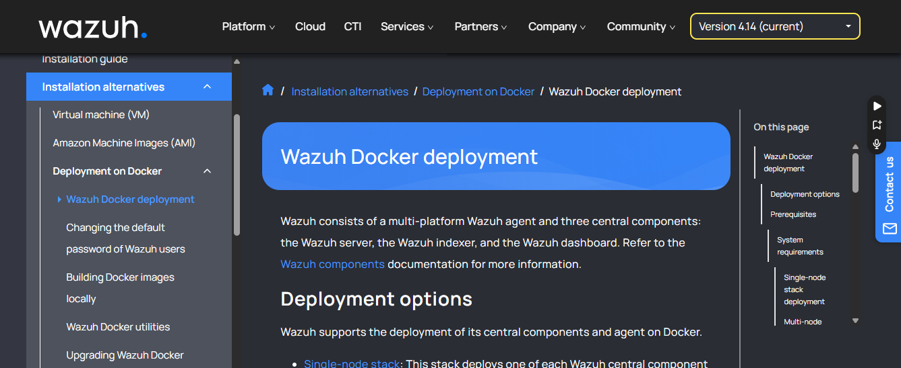
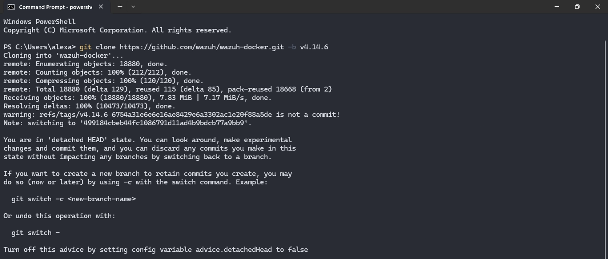
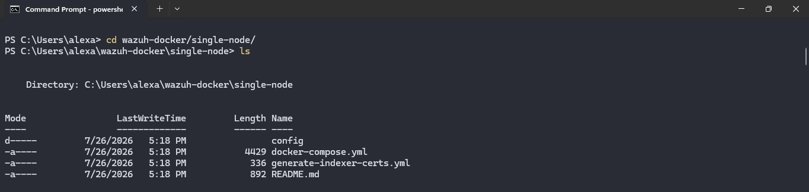
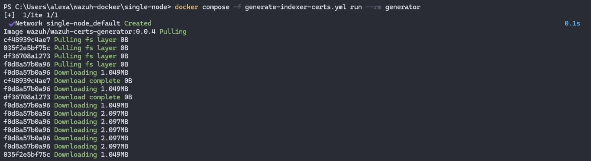
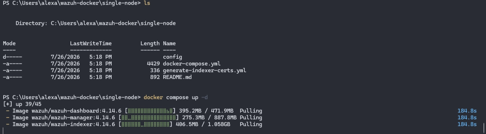
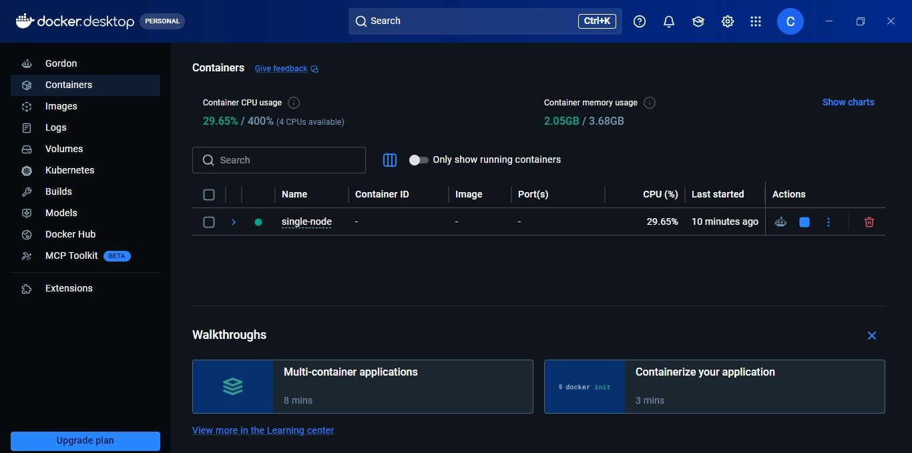
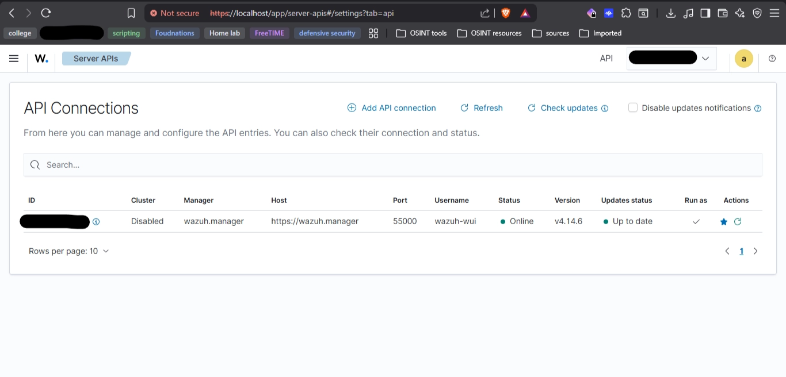

# Initial Lab Setup

This document covers the initial setup of the Budget-Friendly SOC Home Lab. The lab consists of two monitored endpoints:

- **Windows 11 Host** (Wazuh Server and Wazuh Agent)
- **Kali Linux Virtual Machine** (Attacker machine and Wazuh Agent)

Using this configuration allows us to generate realistic attack telemetry while monitoring both a Windows host and a Linux system.

---

# Lab Overview

| Component | Purpose |
| --- | --- |
| Windows 11 Host | Wazuh Server, Windows-Wazuh Agent  |
| Kali Linux VM | Attacker machine , linux-Wazuh Agent |

This setup provides visibility into activity occurring on both operating systems while keeping hardware requirements relatively low.

---

# Requirements

Before beginning the installation, ensure the following software is available:

- Oracle VirtualBox
- Oracle VirtualBox Extension Pack
- Kali Linux ISO
- Docker Desktop (Windows)
- Git

---

# Host System Specifications

The lab was built using the following hardware specifications.

| Component | Specification |
| --- | --- |
| Operating System | Windows 11 |
| Memory | 8 GB RAM |
| Storage | 237 GB SSD |
| CPU  | 4 |

Although this hardware meets the minimum requirements for a basic SOC lab, allocating additional RAM and storage will improve performance.

---

# Kali Linux Virtual Machine Configuration

A minimal Kali Linux virtual machine setup is used.



## Recommended Installation

- Kali Linux (Default Installer)
- Default toolset (includes the standard Kali tools) and xfce desktop environment
- 80 GB Virtual Disk

> **Note:** A minimal installation is acceptable, but the default Kali installation provides the standard toolkit used throughout this project.
> 

---

## Virtual Machine Settings

| Setting | Value |
| --- | --- |
| Base Memory | 4096 MB (4 GB) |
| Processors | 2 vCPUs |
| Video Memory | 128 MB |
| Storage | 80 GB |

---

# Wazuh Deployment



The lab uses the **Single-Node Docker Deployment** provided by the official Wazuh project.

## Wazuh System Requirements

According to the official Wazuh documentation, the minimum requirements for a Single-Node Docker deployment are:

| Requirement | Minimum |
| --- | --- |
| Operating System | Linux or Windows |
| Architecture | AMD64 (x86_64) or ARM64 (AARCH64) |
| CPU | 4 Cores |
| Memory | 8 GB RAM |
| Storage | 50 GB |

Our Windows 11 host satisfies these requirements and is capable of running a basic Wazuh Single-Node deployment.

---

# Installing Wazuh

## Clone the Repository

Clone the official Wazuh Docker repository.

```bash
git clone https://github.com/wazuh/wazuh-docker.git -b v4.14.6
```



Navigate to the Single-Node deployment directory.

```bash
cd wazuh-docker/single-node
```

---



# Generate SSL Certificates

Wazuh requires certificates to secure communication between its components.

Generate self-signed certificates using the provided Docker image.

```bash
docker compose -f generate-indexer-certs.yml run --rm generator
```



The generated certificates will be stored in:

```
wazuh-docker/single-node/config/wazuh_indexer_ssl_certs/
```

---

# Deploy the Wazuh Stack

Start the Single-Node deployment.

```bash
docker compose up -d
```



Alternatively, the containers can be started through **Docker Desktop** after the compose project has been loaded.



---

# Access the Wazuh Dashboard



Once all containers have started successfully, open a web browser and navigate to:

```
https://localhost
```

or

```
https://<DOCKER_HOST_IP>
```

---

# Default Credentials

Use the following credentials to log in to the Wazuh Dashboard.

| Field | Value |
| --- | --- |
| Username | admin |
| Password | SecretPassword |

> **Important:** Change the default administrator password after the initial login if this lab will be connected to any network outside of your isolated testing environment.
> 


---

## Next Step

After successfully deploying Wazuh, the next phase is to install and register **Wazuh Agents** on both monitored endpoints:

1. Windows 11 Host
2. Kali Linux Virtual Machine

Once both agents are connected, the SOC lab will be ready for attack simulations, log collection, and security monitoring.

**references:**

[https://documentation.wazuh.com/current/deployment-options/docker/wazuh-container.html](https://documentation.wazuh.com/current/deployment-options/docker/wazuh-container.html)

[https://docs.docker.com/desktop/setup/install/windows-install/](https://docs.docker.com/desktop/setup/install/windows-install/)

[https://git-scm.com/install/windows](https://git-scm.com/install/windows)

[https://www.virtualbox.org/wiki/Downloads](https://www.virtualbox.org/wiki/Downloads)
