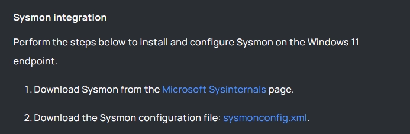
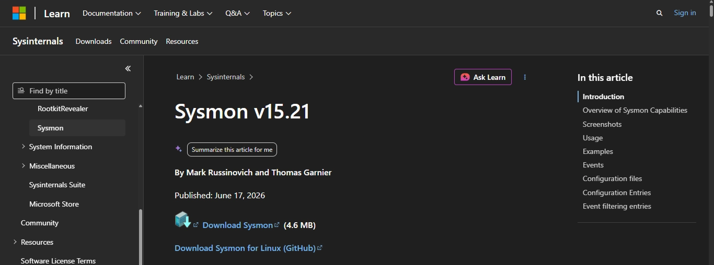
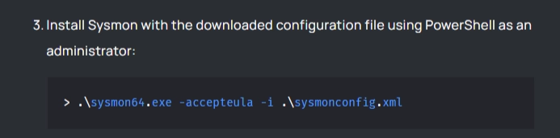
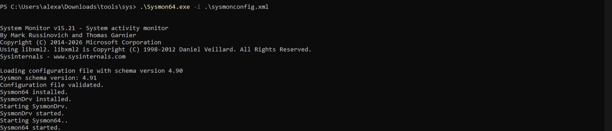
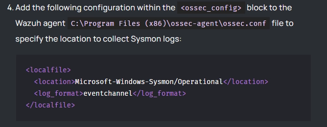
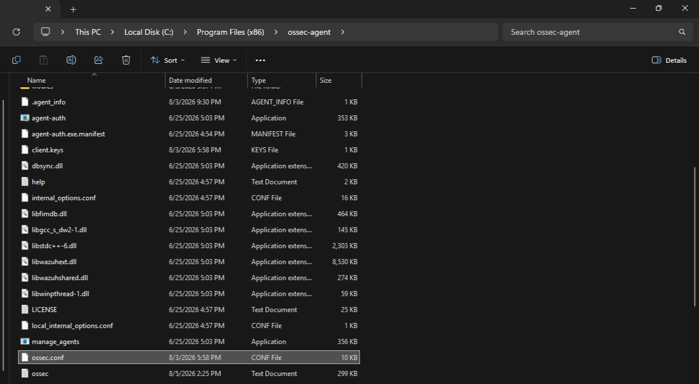
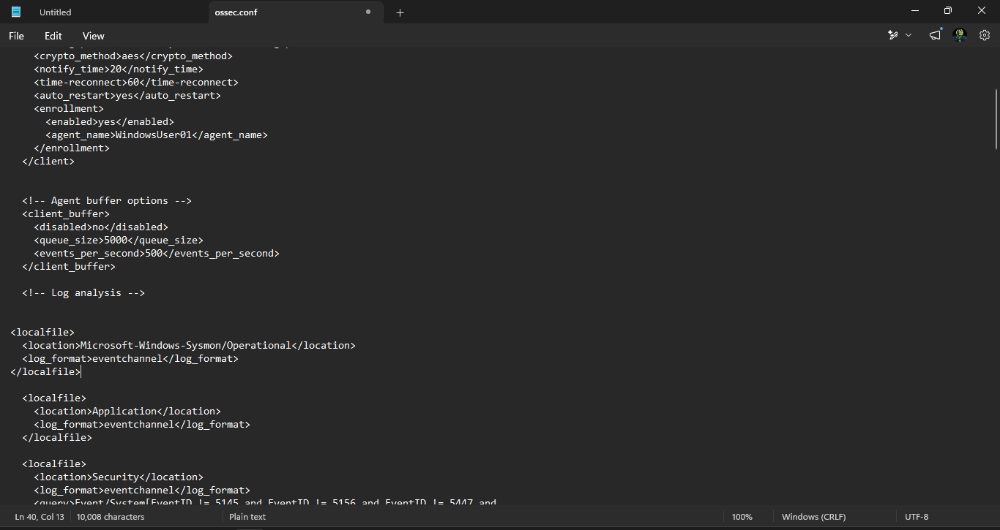
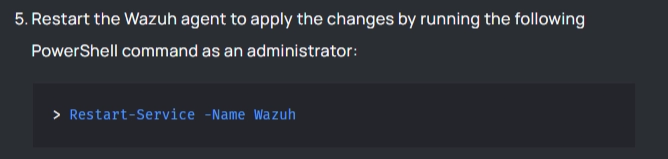
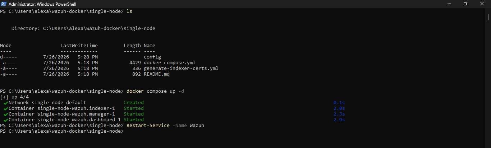

# Sysmon setup and Integration

---

- [x] p1

---

- [x] p2

references:

[https://documentation.wazuh.com/current/user-manual/manager/event-logging.html](https://documentation.wazuh.com/current/user-manual/manager/event-logging.html)

[https://learn.microsoft.com/en-us/sysinternals/downloads/sysmon](https://learn.microsoft.com/en-us/sysinternals/downloads/sysmon)
