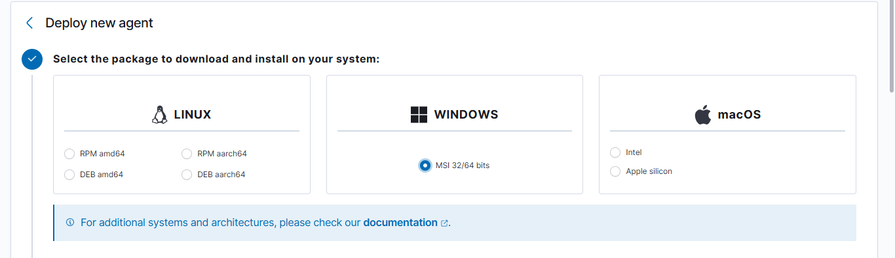
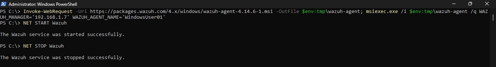
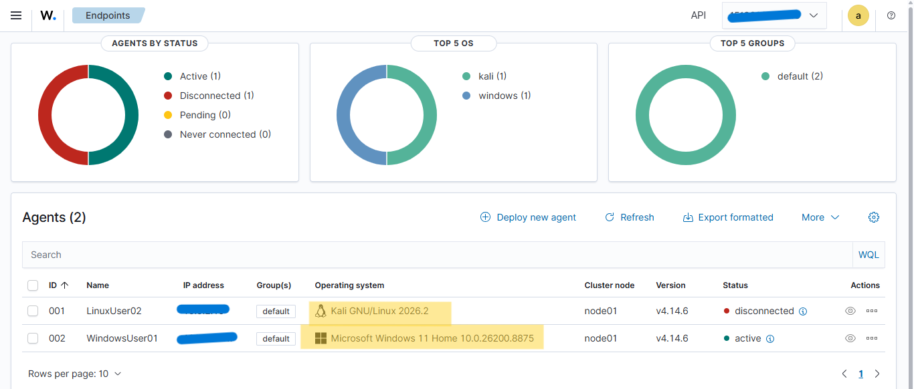

# Wazuh Agent Architecture Update

## Overview

To clarify the previous setup, it was stated that the Wazuh server monitors its own environment through **Agent 000**. This remains correct; however, in this homelab the Wazuh Manager is deployed using **wazuh-docker**, meaning the manager and Agent 000 operate within the Docker container environment rather than directly on the Windows host.

To monitor the **Windows 11 main host** and collect host telemetry (e.g., Windows Event Logs and Sysmon events), a separate Wazuh Agent is installed on the host operating system.

The installation process is similar to the Linux agent setup performed previously.

---

## Windows Agent Setup

**Installation package**



- Windows MSI (32-bit/64-bit)

**Wazuh Manager address**

- Windows host IPv4 (WLAN) address

**Agent name**

- `WindowsUser01`

### Installation Command


```powershell
Invoke-WebRequest -Uri <https://packages.wazuh.com/4.x/windows/wazuh-agent-4.14.6-1.msi> -OutFile $env:tmp\wazuh-agent; msiexec.exe /i $env:tmp\wazuh-agent /q WAZUH_MANAGER='<server_addr>' WAZUH_AGENT_NAME='WindowsUser01'
```

### Start the Wazuh Agent

```powershell
NET START Wazuh
```

### Stop the Wazuh Agent

```powershell
NET STOP Wazuh
```



**Wazuh-Agents:**


