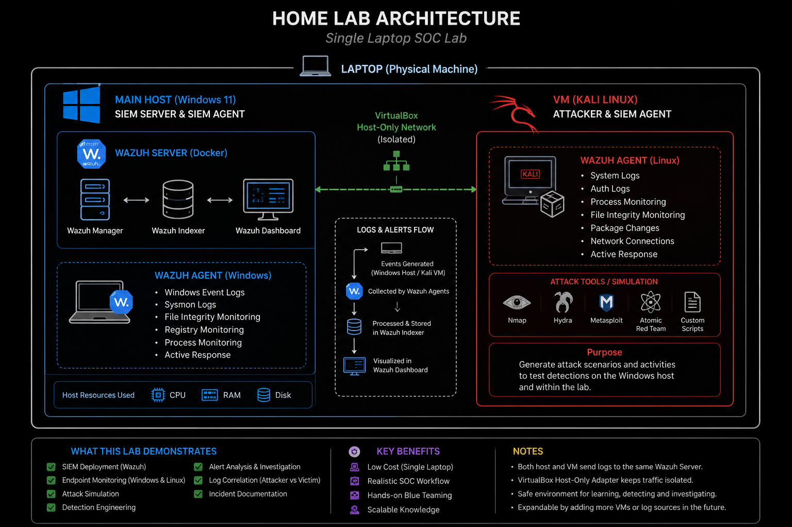

<h1 align="center">Budget-Friendly SOC Lab</h1>
<h3>Why this lab?</h3>
 
<blockquote>
This project demonstrates how to build a functional SOC lab using a single Windows laptop and one Kali Linux VM. The goal is to maximize hands-on learning with limited hardware while exploring endpoint monitoring, detection engineering, and incident investigation using Wazuh.
</blockquote>

